<p align="center">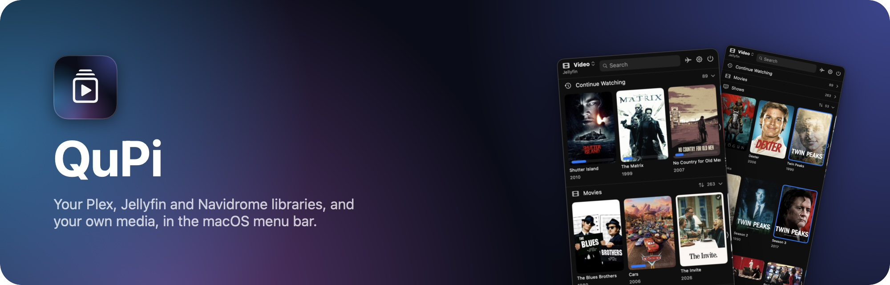</p>

CineTray puts your movies, shows and music in the macOS menu bar. Browse Plex, Jellyfin, Navidrome, TorrServer and your own folders in one menu, pick up where you left off, and play anything, MKV and AVI included.

<table>
  <tr>
    <td align="center">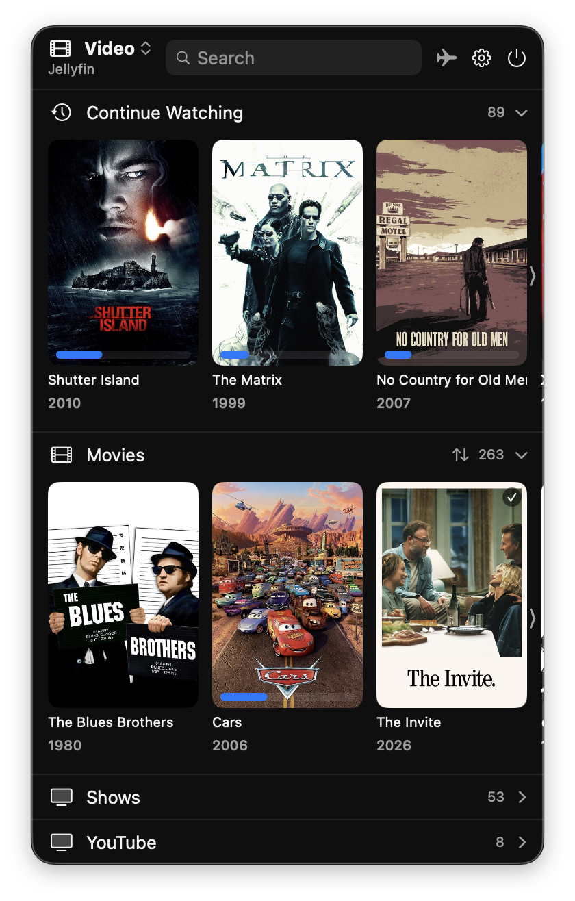<br><sub>Continue Watching and your libraries</sub></td>
    <td align="center">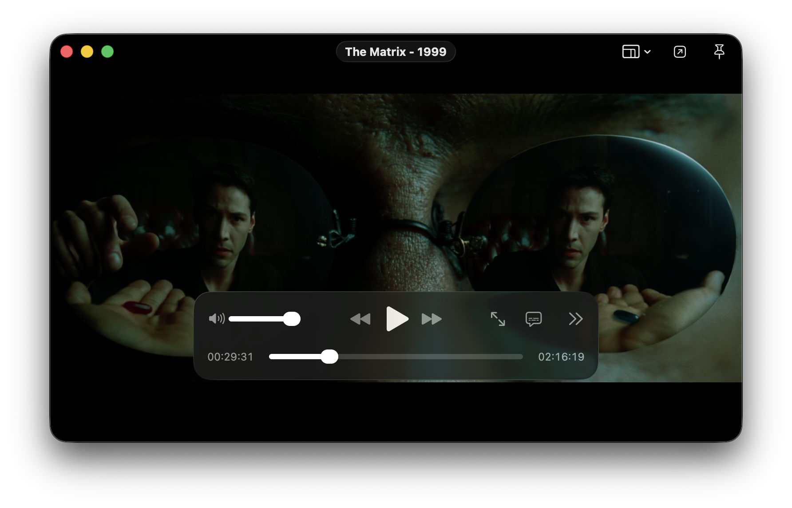<br><sub>Video player</sub></td>
  </tr>
</table>

```sh
git clone https://github.com/p3rception/CineTray.git && cd CineTray && make
```

Or with Homebrew, on Apple Silicon:

```sh
brew install p3rception/tap/cinetray
```

Requires macOS 26. No Xcode needed; see [Install and update](#install-and-update).

## Works with

| Play from | |
|:-|:-|
|  **Plex** | Movies, shows and music, from one or more servers |
|  **Jellyfin** | Movies, shows and music |
|  **Navidrome** | Music |
| 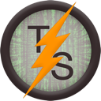 **TorrServer** | Movies and shows, with releases of the same show grouped into one poster |
|  **Your own folders** | Movies, shows and music |

| Connect (all optional) | |
|:-|:-|
|  **Radarr**  **Sonarr** | Release calendar |
|  **Seerr** | Request movies and shows you don't have |
|  **Trakt**  **Last.fm** | Scrobbling, plus artwork for your own files |
| 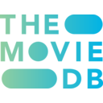 **TMDb** | Posters for your own movies and shows |
|  **Deezer**  **MusicBrainz**  **TheAudioDB**  **Discogs** | Covers and artist photos for your own music |

Connect servers and services in Settings > Accounts, and choose folders in Settings > Data.

## All features

<details>
<summary><strong>Show the full list</strong></summary>

*   **Navidrome support.** Music from a Navidrome server, next to Plex, Jellyfin and your own folders.
*   **TorrServer support.** Movies and shows from a TorrServer. Releases of the same show are grouped into one poster, with seasons and episodes read from the file names.
*   **Your libraries, your names.** The menu shows one section per server library, named as on the server (for example Movies, Shows and YouTube). Choose which libraries appear in Settings > Libraries.
*   **Video and Music panes.** Click the menu title to switch between video and music. The Music pane has Artists, Albums and Playlists sections.
*   **Players.** Control music from the inline player in the menu, or open a separate music or video player window.
*   **Sorting.** Movies and shows are sorted by date added, newest first, by default. A small sort button on each open section changes the field and order without opening Settings. Drag the menu's sections into any order in Settings > Libraries.
*   **Continue Watching.** Merges the server's own list (Plex Continue Watching, Jellyfin Resume and Next Up) with what you started in CineTray. Movies and episodes resume where you stopped, on any device, and posters show watched checkmarks and progress bars.
*   **Search.** Ignores spacing, punctuation and accents ("madmen" finds "Mad Men") and shows only the sections with matches.
*   **Open in Plex or Jellyfin.** Hover a poster and click the arrow at its top right (or use the player's toolbar button) to open that item in the server's web app: browse in CineTray, watch in Plex or Jellyfin.
*   **Release calendar.** Connect Radarr and Sonarr in Settings > Accounts, and a calendar button in the menu shows their upcoming movies and episodes: a month view with a dot on each day with releases, and a list of the coming week.
*   **Requests with Seerr.** Connect Seerr in Settings > Accounts, and searching also lists the movies and shows you don't have yet. Click a poster, then Request; for a show, pick the seasons.
*   **Your video player.** Play video in CineTray's own player, in IINA or VLC with one click, or in any other installed app, such as QuickTime Player (Settings > Playback). IINA and VLC get the original file, with all its subtitles and audio tracks. The built-in player lets you pick the audio track and subtitles for every format, MKV and AVI included, shift subtitles earlier or later, and set their size. Jellyfin videos list the same subtitles as Jellyfin's web app, subtitle files stored next to the video included.
*   **Downloads and Offline Mode.** Download movies, episodes and music to watch and listen without a connection. Offline Mode plays downloads alone.
*   **Scrobbling and artwork.** Trakt and Last.fm scrobbling, with API keys entered in Settings > Accounts; [Connect Trakt, Last.fm, TMDb and Discogs](#connect-trakt-lastfm-tmdb-and-discogs) says where to get them. Your own music gets covers and artist photos from Deezer, MusicBrainz, Last.fm, TheAudioDB or Discogs; turn each one on or off.
*   **Easy sign-in.** Jellyfin Quick Connect (approve a code from another signed-in device, no password). Server addresses work without `http://` or `https://`; the app uses HTTPS, and falls back to HTTP only for addresses on your local network. The TMDb API key field checks the key as you type.
*   **Security.** The Plex token is never sent over plain HTTP to remote servers or saved inside poster URLs, and all tokens and API keys are stored in the Keychain.
*   **Fast.** Sources load in parallel, Plex checks all server addresses at once, the menu refreshes in the background when opened, and Jellyfin plays compatible files directly, so videos start in under a second.
*   **Update notices.** When a new version is out, the menu bar icon turns blue and a line in the menu copies `brew upgrade cinetray`, or opens the release page if you built CineTray yourself.
*   **Logs for bug reports.** Settings > General > Export Logs saves the errors CineTray ran into since it was opened, such as a server it couldn't reach or playback that failed, as a text file. They also appear in Console.app under the subsystem `CineTray`.
*   **Keyboard shortcuts in windows.** While a player or Settings is open, CineTray gets a Dock icon and a menu bar, so Full Screen, Hide and Close shortcuts work.
*   **Homebrew, or build without Xcode.** Install with `brew install p3rception/tap/cinetray`, or clone and run `make`: it builds, signs and installs the app using only the Command Line Tools.

</details>

See [CHANGELOG.md](CHANGELOG.md) for the full history.

## A quick tour

### Browse everything in one menu

The menu shows one section per library, named as on your server (Movies, Shows, YouTube), and libraries with the same name on different servers share a section. Click the menu title to switch between the **Video** and **Music** panes. **Continue Watching** merges Plex Continue Watching and Jellyfin Resume and Next Up with what you started in CineTray, so movies and episodes resume where you stopped, on any device.

**Search** ignores spacing, punctuation and accents ("madmen" finds "Mad Men") and shows only the sections with matches.

<table>
  <tr>
    <td align="center">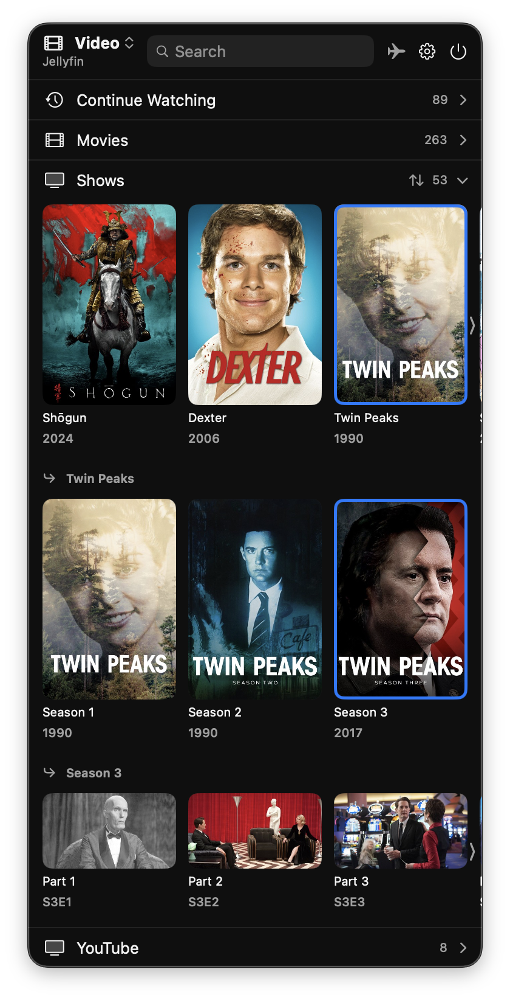<br><sub>Shows, seasons and episodes</sub></td>
    <td align="center">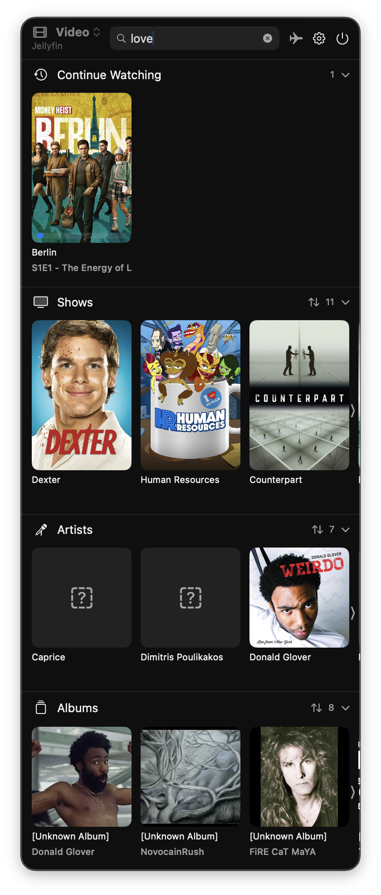<br><sub>Search across every section</sub></td>
  </tr>
</table>

### Watch and listen your way

Play video in CineTray's own player, or in **IINA**, **VLC** or any other app with one click. The built-in player handles MKV and AVI, lets you pick the audio track and subtitles, and shifts and resizes subtitles. Music plays from the **inline player** in the menu or a separate player window.

Prefer your server's web app? Hover a poster and click the arrow to **open it in Plex or Jellyfin**. Connect **Trakt** and **Last.fm** to scrobble what you watch and hear.

<table>
  <tr>
    <td align="center">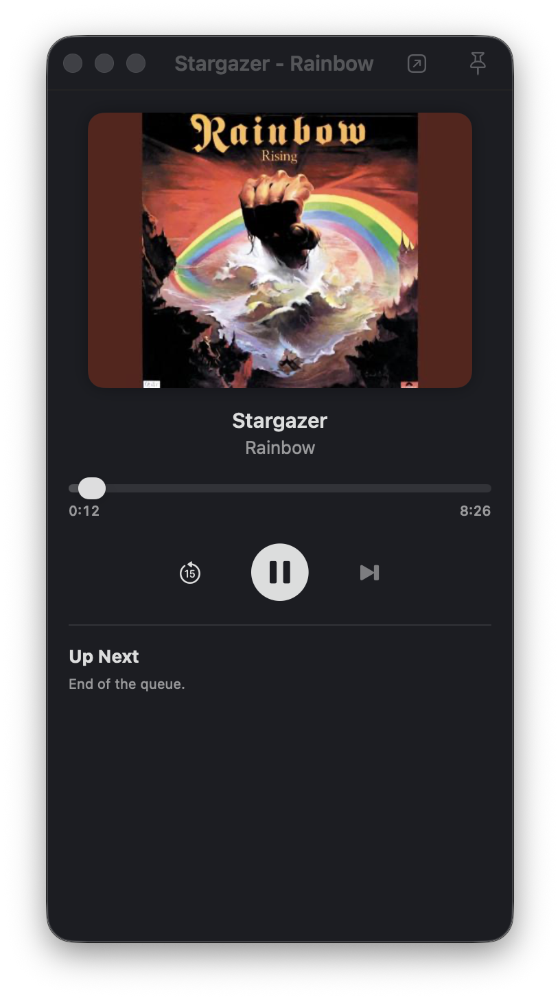<br><sub>Music player</sub></td>
    <td align="center">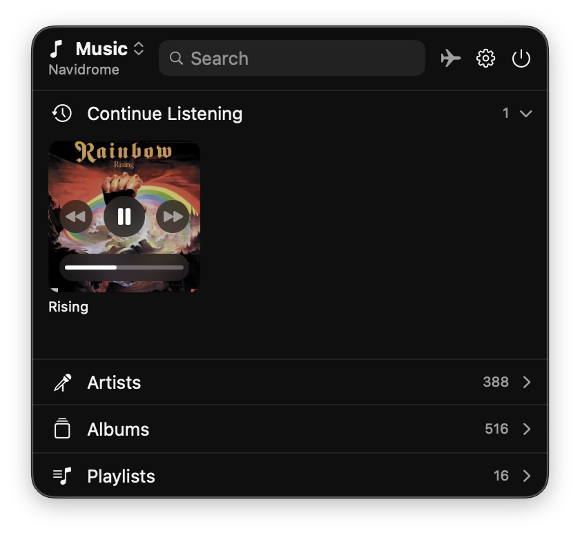<br><sub>Music pane with inline player</sub></td>
  </tr>
</table>

### Find what's next

Connect **Radarr** and **Sonarr**, and a calendar button shows upcoming movies and episodes. Connect **Seerr**, and search also lists what you don't have yet: click a poster, then Request, and pick the seasons for a show.

<table>
  <tr>
    <td align="center">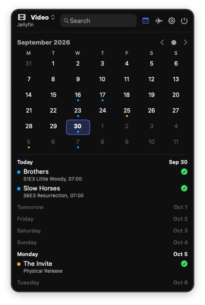<br><sub>Release calendar</sub></td>
    <td align="center">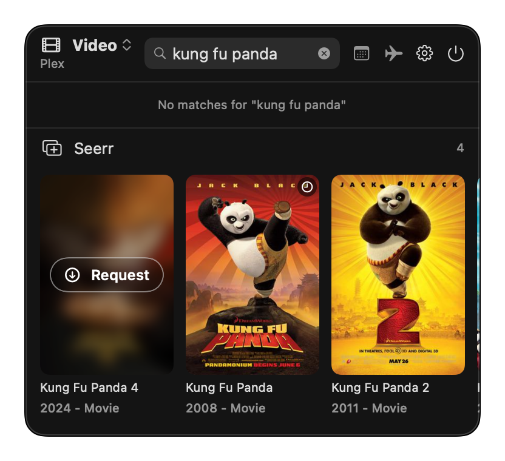<br><sub>Requests with Seerr</sub></td>
    <td align="center">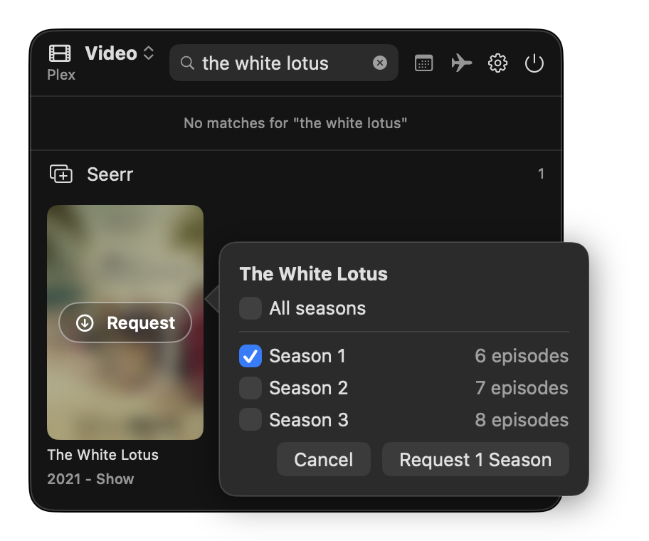<br><sub>Pick the seasons</sub></td>
  </tr>
</table>

### Your files, online or offline

**Download** movies, episodes and music, and **Offline Mode** plays them without a connection. Point CineTray at your own media folders and they join the server libraries, with posters from Trakt and TMDb and music covers from Deezer, MusicBrainz, Last.fm, TheAudioDB or Discogs.

### Make it yours

Choose which libraries appear and drag them into any order in Settings > Libraries. Change the sort of an open section with its sort button; movies and shows start with the newest added. Turn posters off for a compact, text-only menu.

<table>
  <tr>
    <td align="center">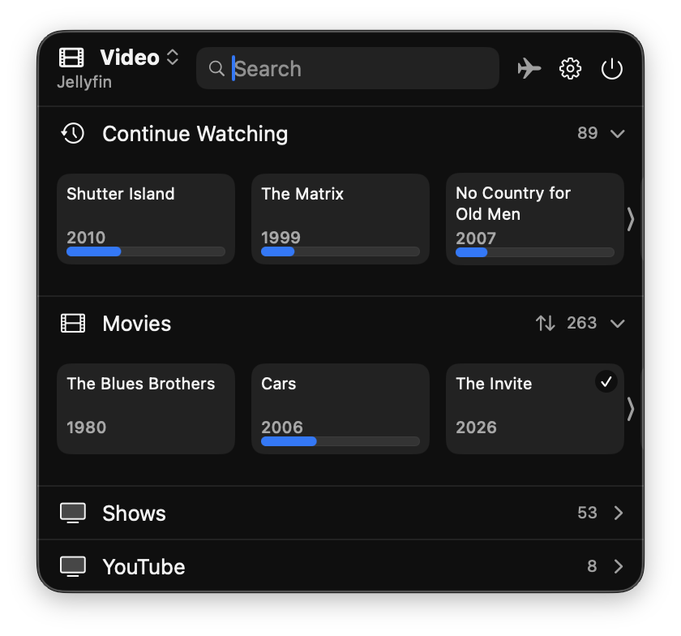<br><sub>Show Posters off</sub></td>
    <td align="center">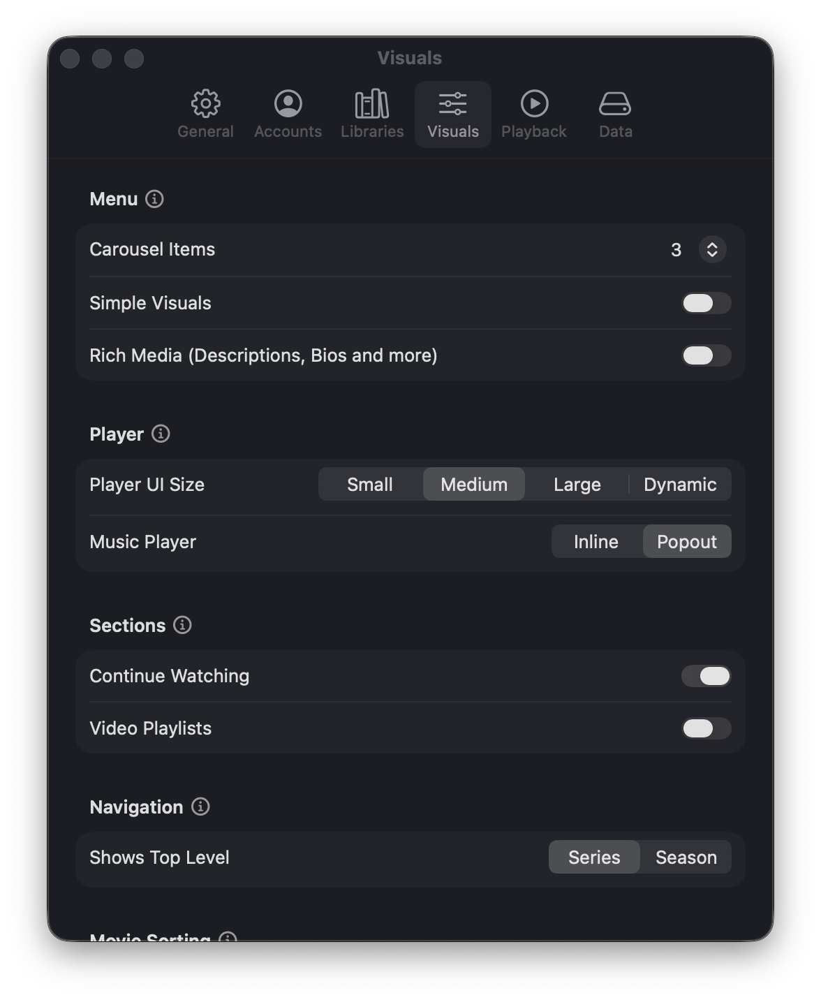<br><sub>Settings</sub></td>
  </tr>
</table>

## Install and update

CineTray checks GitHub once a day for a new version. When one is out, the menu bar icon turns blue and the menu shows how to update. Turn this off in Settings > General.

### With Homebrew

Requires macOS 26 or later on an Apple Silicon Mac.

```sh
brew install p3rception/tap/cinetray
```

Update with `brew upgrade cinetray`, remove with `brew uninstall cinetray`. Settings, accounts and downloads stay.

CineTray is not notarized, so macOS blocks the first launch. Open System Settings > Privacy & Security and click Open Anyway.

### From source

Requirements: macOS 26 or later, plus either the Command Line Tools (`xcode-select --install`) or Xcode 26.4 or later. The SwiftVLC package requires Swift 6.3.

```sh
git clone https://github.com/p3rception/CineTray.git
cd CineTray
make
```

| Command | What it does |
| --- | --- |
| `make` | Builds CineTray, installs it in `/Applications` and opens it. Run it again after `git pull` to update. |
| `make clean` | Deletes the build files (about 4 GB). The installed app keeps working. |
| `make uninstall` | Removes the app. Settings, accounts and downloads stay. |
| `make wipe` | Removes the app and also deletes settings, watch progress, accounts and cached artwork. Downloaded media stays. |

Without an Apple Development certificate the app is signed ad-hoc, so macOS asks again for Keychain access after each rebuild.

For development, `./build.sh` builds `dist/CineTray.app` and opens it without installing. With Xcode, open `CineTray.xcodeproj` and run; it signs to run locally, with no Apple account. To sign with your own team, add a `Local.xcconfig` next to `Signing.xcconfig`, as described in that file. Git ignores it, so your team ID stays on your Mac.

## Connect Trakt, Last.fm, TMDb and Discogs

Optional. Each service needs a free account of your own. The keys go in Settings > Accounts and are kept in the Keychain. Deezer, MusicBrainz and TheAudioDB need no key.

<details>
<summary><strong>Trakt</strong>: scrobbles movies and episodes, finds posters for your own movies and shows</summary>

1. Create an app at https://trakt.tv/oauth/applications/new. Name it `CineTray` and set Redirect uri to `cinetray://trakt-auth`.
2. Copy its Client ID and Client Secret into Settings > Accounts > Trakt.
3. Click Sign in with Trakt and approve.

</details>

<details>
<summary><strong>Last.fm</strong>: scrobbles the music you finish, finds album covers</summary>

1. Create an API account at https://www.last.fm/api/account/create. Leave Callback URL empty; Last.fm only accepts web addresses there, and CineTray doesn't need one.
2. Copy its API Key and Shared Secret into Settings > Accounts > Last.fm.
3. Click Connect to Last.fm…, then Yes, allow access on the page that opens in your browser. CineTray notices within a few seconds.

</details>

<details>
<summary><strong>TMDb</strong>: finds posters for your own movies and shows</summary>

Copy the API Key (v3) from https://www.themoviedb.org/settings/api into Settings > Accounts > The Movie Database. The API Read Access Token doesn't work.

</details>

<details>
<summary><strong>Music artwork</strong>: covers and artist photos for your own music</summary>

Artwork comes from Deezer, MusicBrainz, Last.fm, TheAudioDB and Discogs, in that order. Discogs needs a personal access token from https://www.discogs.com/settings/developers. Turn sources on or off in Settings > Accounts > Music Artwork.

</details>

## Under the hood

*   **Private.** All tokens and API keys are stored in the Keychain. The Plex token is never sent over plain HTTP to remote servers or saved inside poster URLs.
*   **Fast.** Sources load in parallel, Plex checks all server addresses at once, and Jellyfin plays compatible files directly, so videos start in under a second.
*   **Easy sign-in.** Jellyfin Quick Connect needs no password. Server addresses work without `http://` or `https://`; CineTray uses HTTPS, and falls back to HTTP only on your local network.

## Credits

CineTray started as a fork of [KuDoZ007/QP](https://github.com/KuDoZ007/QP) and is now developed as its own project, because the original was abandoned after its initial commit. Continue Watching, watched indicators and parts of the Settings reorganization are based on [#1](https://github.com/p3rception/CineTray/pull/1) by [@iosue-iulianus](https://github.com/iosue-iulianus).
